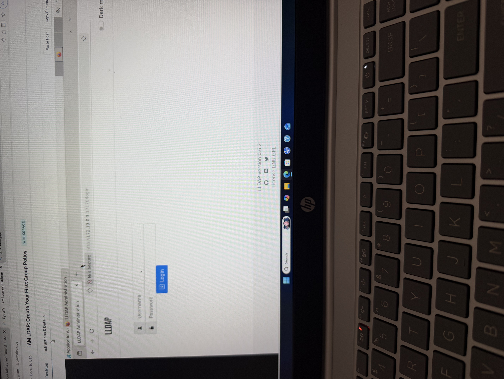

# LDAP Lab: User Provisioning & RBAC

## Objective
Created a user and assigned group-based access in LDAP.

## What I Did
- Created user (analyst1)
- Created group (soc-tier1-readonly)
- Added user to group
- Verified access

## Concepts
- RBAC
- Least Privilege
- Identity Provisioning

## Outcome
Successfully implemented user creation and group-based access control in LDAP.

## 📸 Screenshots

### 1. Login Page

### 2. User Created

### 3. Group Created

### 4. User Assigned to Group (RBAC Applied)

