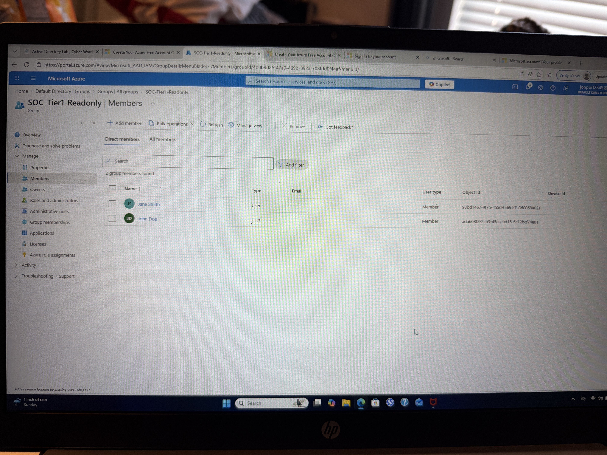

# Azure Entra ID Lab: RBAC Implementation

## Objective
Implement role-based access control (RBAC) using Microsoft Entra ID by creating users, groups, and assigning least-privilege roles.

---

## Environment
- Microsoft Azure (Free Account)
- Microsoft Entra ID (Azure Active Directory)

---

## What I Did

### 1. User Creation
- Created multiple users:
  - John Doe
  - Jane Smith
- Assigned unique usernames and enabled accounts

### 2. Group Creation
- Created a security group:
  - **SOC-Tier1-Readonly**
- Designed to simulate a Tier 1 Security Operations team

### 3. Group Membership
- Added users to the SOC group
- Demonstrated centralized access management

### 4. Role Assignment (RBAC)
- Assigned **Directory Readers** role
- Applied role to users via group membership
- Enforced **least privilege access**

---

## Key Concepts Demonstrated
- Identity & Access Management (IAM)
- Role-Based Access Control (RBAC)
- Microsoft Entra ID
- User provisioning
- Group-based access control
- Least privilege principle

---

## Screenshots

#

#

!

---

## Outcome
Successfully implemented RBAC in Microsoft Entra ID by assigning least-privileged access to users through group-based role assignments.
