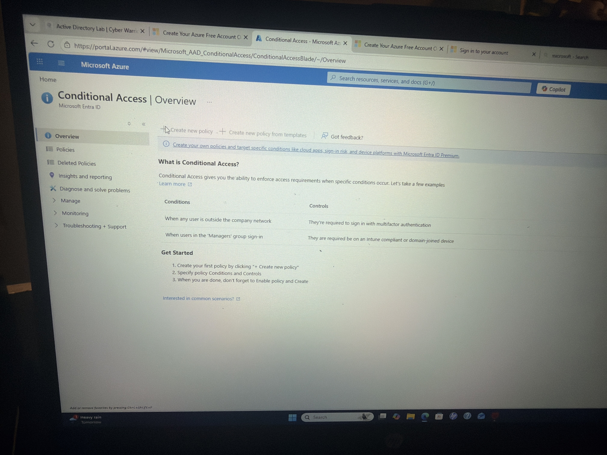
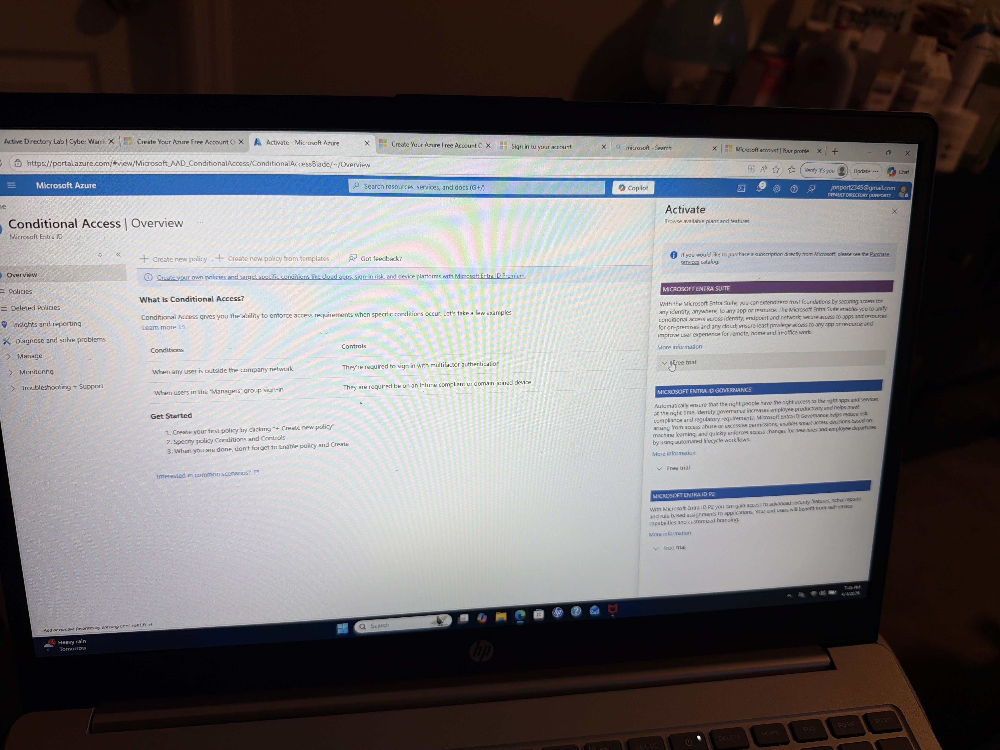
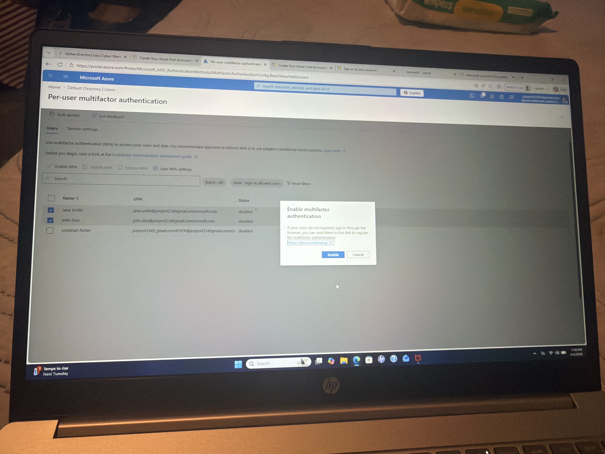

# Azure Entra ID Lab: Multi-Factor Authentication (MFA)

## Objective
Implement Multi-Factor Authentication (MFA) to strengthen user authentication security.

---

## Environment
- Microsoft Azure (Free Account)
- Microsoft Entra ID

---

## What I Did

### 1. Attempted Conditional Access Policy
- Navigated to Conditional Access
- Attempted to create a new policy
- Identified licensing limitation (Entra ID Premium required)

### 2. Implemented MFA (Alternative Control)
- Enabled MFA for selected users
- Applied additional authentication layer
- Strengthened account security

---

## Key Concepts Demonstrated
- Identity & Access Management (IAM)
- Multi-Factor Authentication (MFA)
- Conditional Access (concept)
- Security controls & mitigation
- Least privilege principle

---

### Screenshots

### Conditional Access Attempt (Overview)

### Conditional Access (License Requirement)

### Multi-Factor Authentication (MFA Enabled)

---

## Outcome
Successfully implemented MFA as a compensating control when Conditional Access policies were unavailable due to licensing limitations.
