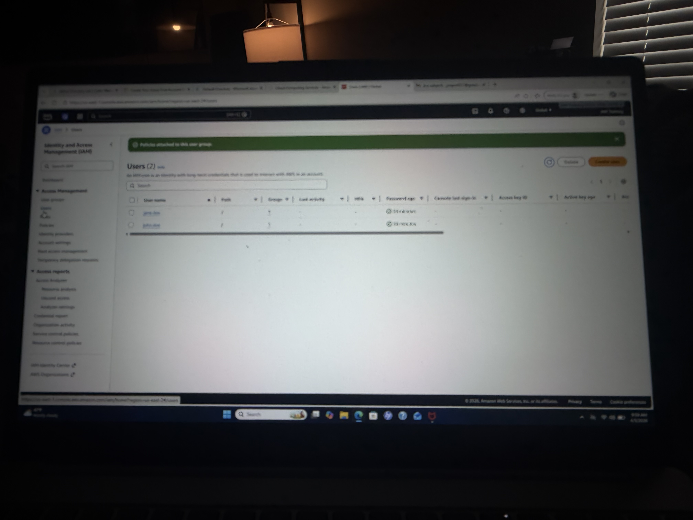

# AWS IAM Lab: S3 Access with Custom Policy

## Objective
Create a custom IAM policy to control access to a specific S3 bucket using least privilege.

---

## Environment
- AWS Free Tier
- IAM (Identity and Access Management)
- Amazon S3

---

## What I Did

### 1. Created S3 Bucket
- Created a bucket:
  - iam-lab-jp
- Used as target resource for access control

---

### 2. Created Custom IAM Policy
- Built a JSON policy with:
  - s3:ListBucket
  - s3:GetObject
- Restricted access to ONLY the specific bucket

---

### 3. Attached Policy to Group
- Attached custom policy to:
  - S3-ReadOnly-Group
- Combined with existing AWS managed policy

---

### 4. Verified Access Structure
- Users inherit permissions through group membership
- Ensured least-privilege access to S3 resources

---

## Key Concepts Demonstrated
- IAM Policies (JSON)
- Resource-Level Permissions
- Least Privilege Principle
- AWS S3 Access Control
- Group-Based Permission Management

---## Screenshots

### S3 Bucket Created

### Custom Policy Created

### Policy Attached to Group

### IAM Users

### S3 Bucket (Empty View)

---

## Outcome
Successfully implemented a custom IAM policy to restrict S3 access to a specific bucket, enforcing least privilege through group-based permissions.
