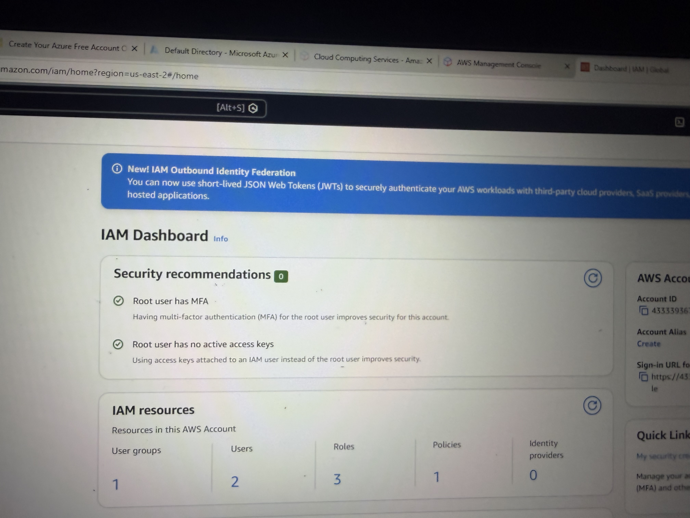
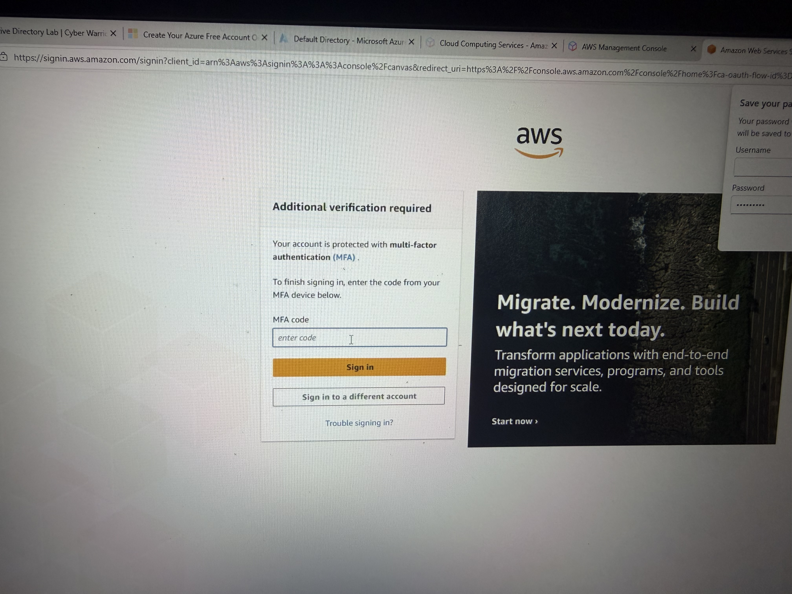

# AWS IAM Lab 6: Multi-Factor Authentication (MFA)

## Objective
Enhance account security by enabling Multi-Factor Authentication (MFA) for root and IAM users.

---

## What I Did

- Enabled MFA for AWS root account
- Enabled MFA for IAM users
- Configured authenticator app
- Tested MFA login flow
- Reviewed IAM dashboard security recommendations

---

## Key Concepts

- Multi-Factor Authentication (MFA)
- Identity Security
- Account Protection
- Authentication Layers
## Screenshots

### IAM Dashboard (Security Status)

### IAM User MFA Enabled

### MFA Login Prompt

### Root Account MFA Enabled

## Result

- MFA successfully enabled for root and IAM users
- Login now requires additional verification
- Security posture improved
- Reduced risk of unauthorized access

---

## Skills Demonstrated

- AWS IAM
- Identity Security
- MFA Configuration
- Security Best Practices
